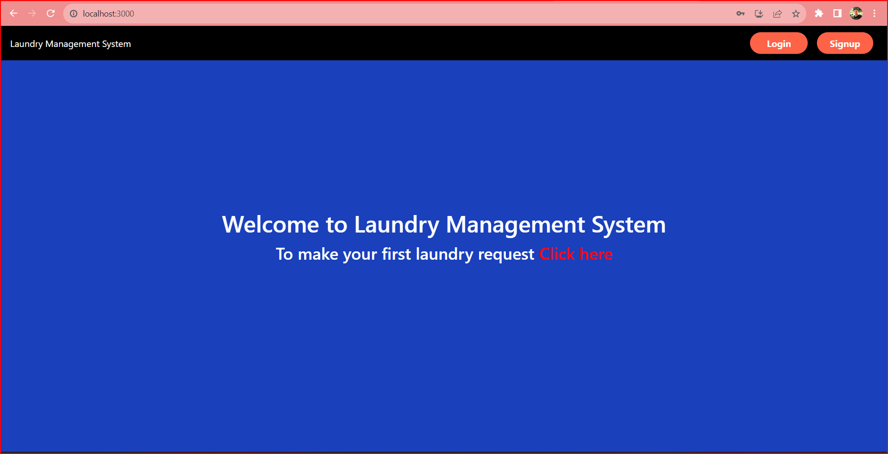
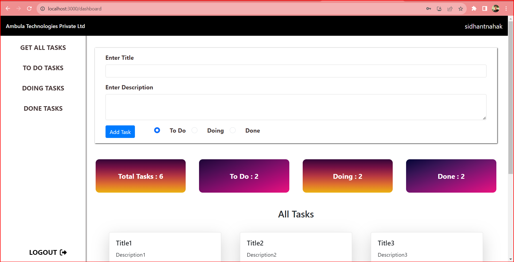
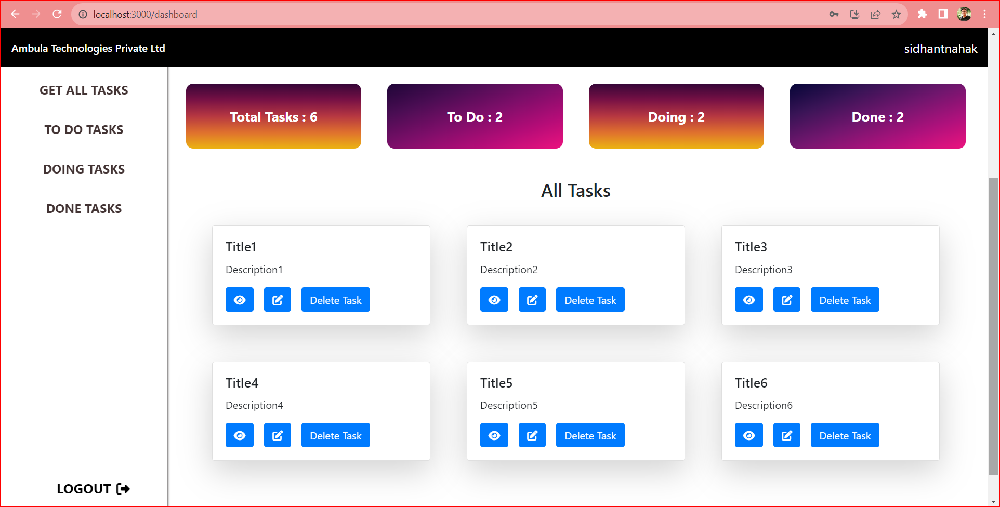
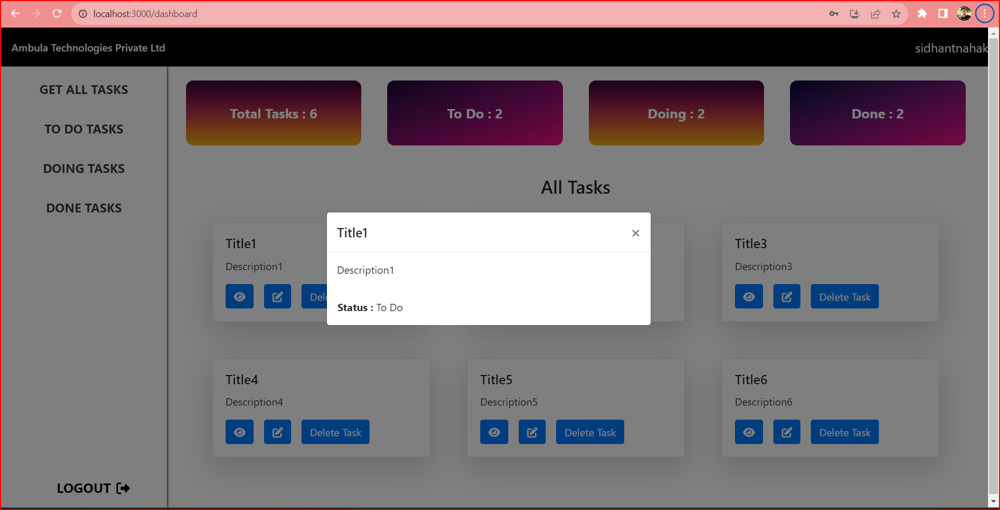
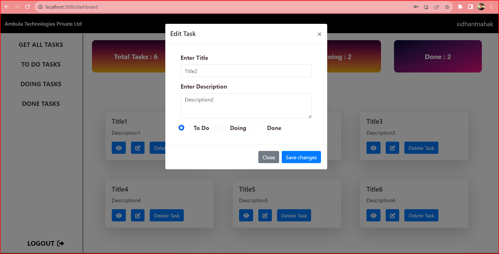

# Ambula Technologies Private Limited
***Introduction***
---
About
A Task management system app which has some features like user authentication and authorization functionalities for the users like CRUD operation on tasks.

🚀 Getting Started 
Clone the repository Install dependencies with npm install 
Run the development server with  npm start

## Demo

[https://task-management-system-clone2.netlify.app/](https://task-management-system-clone2.netlify.app/)

## Tech-stack used

Frontend : Html5, Css3, Javascript, React js, Bootstrap, React redux 
Backend : Node.js, Express.js 
Database : MongoDB 

## Features
1.User authentication and authorization functionalities 
2.Crud Operation On Tasks
   
**Sample Page Images**

